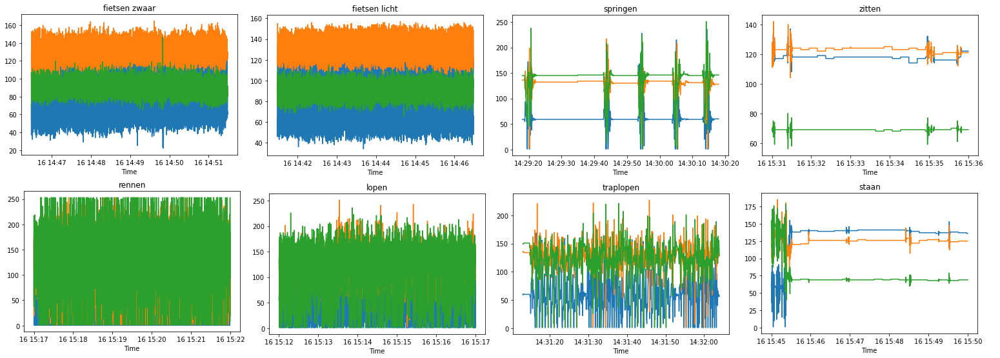
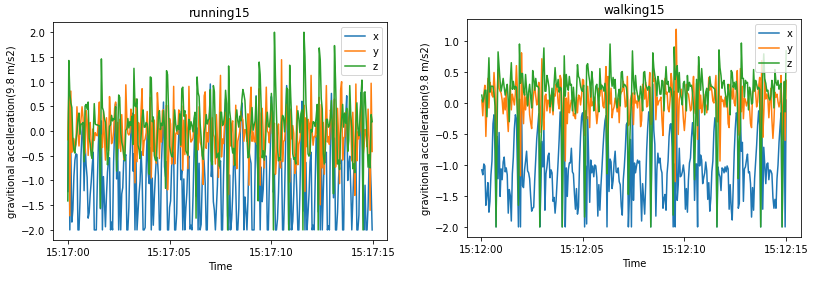
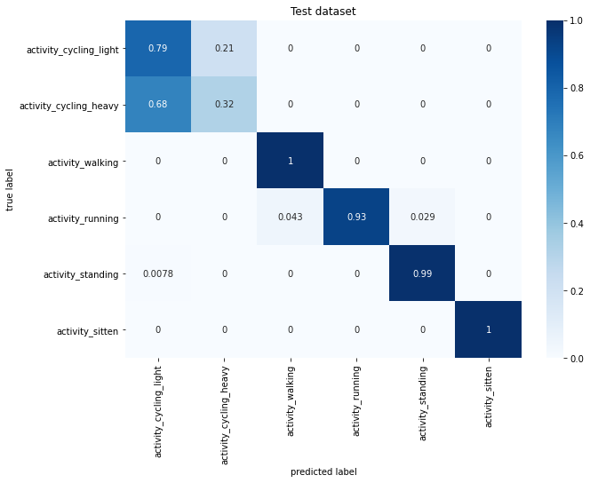

# portfolio
naam: Adnan Akbas
studentnummer: 17005116

## Project ActivPal
CBS also known as Statics Netherlands wants to know if their respondents are moving for at least 150 minutes per week in
moderately intense physical activity. At this moment CBS is asking their respondents or asking them question about 
their week.  This form of collecting information is unfortunately not reliable since it relies on the  memory 
of the respondents.  For this reason CBS has been looking for alternative solutions like a ActivPal Accelerometer. CBS 
has asked us to research if we can see if  can determine if their respondents did their 150 minutes of moderate 
activity with week data from ActivPAL accelerometer.

To answer this question we have created following research questions:

 1. **How can Machine Learning be used to predict the intensity of activities performed in a lab situation by a person, who is being monitored with Vyntus One and wearing ActivPal accelerometer?**
	 - *What measurement does ActivPal use for intensity and why?*
	 -  *Is it possible to extract this intensity measurement values from just Vyntus One data, if so, how?*
 2. **How can Machine Learning be used to predict the intensity of activities performed by a person wearing only the ActivPal accelerometer, based on the data gathered from Vyntus One and ActivPal accelerometer in the lab situation?**
	 - *What machine learning model can best be used to measure the intensity for each activity?*
 3. **How can Machine Learning be used to determine whether people did their 150 minutes of moderate activity in ActivPal accelerometer data of an entire week?**
	 -  *How can Machine Learning be used to recognize the activities, performed in the lab situation, in the ActivPal accelerometer data?*
src: [research_plan.pdf](evidence/documents/research_plan.pdf)


### Team members
- [Ali](https://github.com/ASafdari/activPAL-Portfolio)
- [Colin](https://github.com/colinrw/ActivPal-Portfolio)
- Mark
- Matthew

## Reflection
<details> <summary>Reflection on own contribution to the project.</summary>

**Situation**
As a Software engineering student, I have quite a bit of experience with programming but almost none with machine learning models, visualization and python. I knew that I had to learn al lot if I want to contribute to my project. Which wasn't a problem I was motivated from the moment we started with with the project. For me, this was a great opportunity to work with people from different study fields. I wanted to work on my communication skills and I wanted to take more initiative. 

**Task** 
So for me, the task ahead was to communicate clearly with my team. I wanted to keep my team up to date with my progress so everybody knew what I was doing. Next, I needed to take initiatives on stuff that needed to be worked on.

**Action**
At the stand-ups, I always told my team what I did yesterday, what I was going to do today and if I was stuck with something. I was also actively talking in meeting to communicate clearly what I thought meeting subject.

Throughout the project, I worked on activity recognition model. I mostly did this alone with allot of research on the subject. I researched what needs to be done with data, what kind of model I could use and how to configure them. 

Next to that I also helped my team members on their issues. It could be understanding a formula from a paper, programming issue or not knowing what to do. From the beginning, I showed my teammates that they always can ask me for help.

**result**
I have successfully created an activity recognition model. It can recognize activities with 84% accuracy. Next to that, I saw that with taking initiatives in meeting what I found important got discussed. I also saw that my teammates asked me to a lot of questions on their issues which I always loved to help.

**reflection**
I am happy with my contributions. I have created an activity recognition model which was needed to answer the main research questions. I have created the script that processed accelerometer data. I had helped my teammates when they had an issue, so they could work further. I took initiatives to bring up tasks that we need to be done. For example I brought most of the time up that we need work on the presentation. I also contributed to the research paper by writing 4 important chapters.

</details>

<details> <summary>Reflection on own learning objectives.</summary>

**Situation**
Reflection on own learning objectives.
I have a lot of experience with programming but none with data science. So this Applied Data Science minor was a new world for me.
I knew from the beginning that I going to learn a lot.

**Task**
I worked mainly on the programming side of the project. To be more specific I programmed everything related to activity recognition. This included data pre-processing, selecting models and configuring it. I also actively helped my teammates with programming issues.

**Action**
I started with the literature study, but I wasn't successful in finding useful papers. After this, I tried to explore our data to see what kind of data we got from CBS and what we could do with it. From this point on, I mainly worked on data pre-processing, selecting a model, configuring and training it. 
At the same time, I also followed Datacamp courses. I wanted to refresh my python programming skills and learn more about it.

**result**
Thanks to this minor I have learned a lot. I have learned how to pre-process data and what to look out for. How I can recognize activity from accelerometer data with very simple features. What kind of models exist and what I should for classification tasks. What hyperparameters are and how I can tune it. How I can visualize data in a very clear way and how to do this with python. 

At the end of the minor, I can say that I know how to develop an effective classification model.
**reflection**
When I look back to what I learned I am quite happy. I have learned so much that I am scared to forget some stuff. I have learned how to create a model which was quite interesting. I had no idea that there problems like overfitting and underfitting. Another thing I didn't know that a random forest model has a lot of hyper parameters. I have also learned that most important part Is data preprocessing. I always thought that the model would be import part of data science since it predicts something. But thanks to this minor and my work on the activity classifcation I now know that the selecting and configuring a model is the small part of the whole process. 

Thanks to this minor I now know what I need to do if I want to develop a model and it's awesome. I hope I can use everything I learned in the future.


</details>

<details> <summary>Evaluation on the group project as a whole.</summary>

**Situation**
At the beginning of this project, we started with 6 group member. 4 teammates are from Software Engineering, 1 from Bim and another student from Sport. But in the end, we have left 5 group members because the student from sport decided to stop.

**Task**
We as a group decided that we would work with Scrum but would implement it in our way. That meant we would not follow all of the Scrum rules. Our project group was based on trust, this is also the reason why we didn't sign any contract.

**Action**
At the beginning of the project, we decided that we would split our group in 2 of 3 persons. One group would focus on MET-value prediction and another on data exploration. We saw that it did work but it had issues and slowly let it go. So from that point on we took a different approach. We first created tasks after discussing what we would want to work on and what we want to finish. Next we each person would tell what they want to work on and we assign them to the task. I liked this approach because there was freedom to work on stuff you wanted and it forced you to take initiative to take a task on.
Teammates would communicate with each other while working on tasks and ask questions if they are stuck. We also have a group chat in WhatsApp where we would talk with each other on different subjects.

**result**
I enjoyed how we took on the project. I saw that everybody did their best and were more motivated to work on the tasks they took on themselves. The WhatsApp group chat also helped to keep the group a bit more together and work closely. I also saw that by implementing the Scrum process in our way that everybody tried to be at stand-ups, retrospective and other events.

**reflection**
Thanks to COVID-19 we had to work digitally. Unfortunately, this meant that we didn't see each other in real life which makes communication sometimes difficult. Still, I enjoyed my time with this group. I loved how we talked with each other, that we were open and not scared to throw our ideas in. I know that I am sometimes hard-headed but I am also happy that my teammates would be open with me and give their honest feedback. 

There also of course some downsides. Unfortunately, one teammate left us which I find sad. I hoped he would stay but I do understand his decision. I also felt sometimes that certain teammates wouldn't contribute as much as the rest which I saw becoming an issue. We did bring it up multiple times with each other and did I see some improvement from him.  

After all this, I am still quite happy with this project result. We worked hard to get this far.

</details>


## Datacamp
  

 |Course|Statement of Accomplishment|
 |------|---------------------------|
 | Introduction to python |[proof](evidence/datacamp/introduction_to_python.pdf)|
 | Python Data Science Toolbox (Part 1) |[proof](evidence/datacamp/python_data_science_toolbox_part_1.pdf)|
 | Intermediate Python |[proof](evidence/datacamp/intermediate_python.pdf)|
 | Python Data Science Toolbox (Part 2) |[proof](evidence/datacamp/python_data_science_toolbox_part_2.pdf)|
 | Pandas Foundations |[proof](evidence/datacamp/pandas_foundations.pdf)|
 | Introduction to Data Visualization in Python |[proof](evidence/datacamp/introduction_to_data_visualization_in_python.pdf) |
 | Manipulating Dataframes with pandas |[proof](evidence/datacamp/manipulating_dataframes_with_pandas.pdf)|
 | Data Types for Data Science in Python |[proof](evidence/datacamp/data_types_for_data_science_in_python.pdf)|
 | Cleaning data in Python |[proof](evidence/datacamp/cleaning_data_in_python.pdf)|
 | Preprocessing for Machine Learning in Python |[proof](evidence/datacamp/preprocessing_for_machine_learning_in_python.pdf)|


### Research project
<details> <summary>Task Definition</summary>

In the research plan, I have written the second iteration of the problem domain/context while my teammates have worked on other parts. 
Where they have defined the research question among others. In the second iteration, I have processed the feedback we got from one of our teachers. 


``
Statistics Netherlands (CBS) has the wish to see if their respondents are moving for at least 150
minutes per week in moderately intense physical activity.
Currently, they are measuring by asking their respondent or health surveys. The issue with this is
that people are not very good at estimating the time they spent on moving and sport. This of course
causes that they don't have very reliable data to work with. Therefor CBS has been looking into
alternatives like the ActivPal accelerometer in combination with machine learning to give better and
more accurate results when measuring the intensity of certain activities.
Because of this the CBS started to collect lab tests and started to measure the movements of 41
correspondents in their regular workweek by using the Activepal Accelerator. It's our job to analyse,
structure and build machine learning algorithms based on the collected data to see if we can
determine if people adhere to (inter)national norm for physical activities and if we could measure
the intensity of movement (without the heart rate information).
``

src: [research_plan.pdf](evidence/documents/research_plan.pdf)

</details>

<details> <summary>Conclusions</summary>

Colin and I have written the conclusion in the paper. First, we discussed what the conclusion should be. Then I have
written the first iteration of the conclusion. Colin has written the second, third and fourth iteration of the conclusion.
Each iteration we discussed if the written conclusion is right or if it needs to change. 

Conclusion from the paper:
```
This research shows that it is possible to use Machine Learning to determine if people did their 150 minutes of moderate
 activity within a week. The only issue with this determination lies with the reliability and accuracy of the models 
that make this determination. Recognizing which activity is performed can be predicted with fairly high accuracy, 
the only issue comes with predicting cycling light and heavy. The acceleration data of these activities is almost 
identical and therefore harder to differentiate between. The reason why it is not possible to accurately determine 
if the respondent reached the 150 minutes is because the MET prediction models are overfitting on the training data set.
 This is caused by not having enough respondent characteristics data for the models to generalize. After analysing the 
results of the MET models, we concluded that the MET models were not able to accurately predict the MET values. This 
resulted in not being able to accurately determine if the respondents have done their 150 minutes of moderate intense activity.  
```

</details>

<details> <summary>Planning</summary>

At the beginning of our project, we have decided that we will use Jira as our scrum board, will implement Scrum in our way and won't follow it to the detail.

Our process looked as follows. At the start of each sprint, we decided what the sprint goal is. With a goal in mind, we created tasks which each team member could choose and take it on themself.
Each task can be modified, removed or created while the sprint was going on but it always after discussing with the group.
At 9:30 am from Monday to Friday we were holding a stand-up. At the stand-up we discussed what we did a day earlier, going to today and if we are stuck with something.
We also held retrospectives at the end of each sprint, where we discussed our progress and teamwork.

## My role in scrum
I didn't have a specific role in the scrum process other than a developer but I did actively participate in each phase of the scrum process. At the sprint planning, I have actively created the task after discussing with the team. At the same time, I would assign a task to myself unless other team members would want them. In some cases, we would assign multiple members to a task.  Jira inherently doesn't support assigning multiple members to a task. That's why we would write the names of the assigned members to the tasks.
Each morning I would join the stand-up with my other team members and explain what I did yesterday, what I am gonna do today and if I need help.  At the end of each sprint, I would join retrospective and give my input. I would say what we did well, what didn't go well and what I wish next sprint would get better.

[More information on our take](topics/research_project/planning.md)

</details>

### Domain knowledge

<details> <summary>literature Research</summary>

I have found following literature:
- [Random forest classifier by Tin Kam Ho](evidence/documents/random_forest_classifier_tin_kam_ho.pdf)
- [An Activity Recognition Framework Deploying the Random Forest Classifier and A Single Optical Heart Rate Monitoring and Triaxial Accelerometer Wrist-Band](evidence/documents/activity_recognition_framework_deploying_the_random_forest_classififier.pdf)

There is also paper that i didn't find but I made notes about it:
    - [paper_notes.pdf](evidence/documents/paper_notes.pdf)

</details>


### Data preprocessing
<details> <summary>Data exploration</summary>

I tried to get an idea if there was a pattern in my dataset. If I say pattern I mean that the acceleration data has 
certain behaviour for an activity. The image below does show it quite clearly that each activity has a unique pattern.
 The only exception here is that cycling light and heavy looks quite the same.  At the time I excepted that the activity
  recognition model would have some difficulty to keep them apart.


[Src of the image](evidence/python_notebook/activity_visualization.pdf)

[More Examples](topics/data_preprocessing/data_exploration.md)

</details>

<details> <summary>Data cleaning</summary>

Our dataset was provided by CBS in cleaned state, so there was not much cleaning to do.

</details>

<details> <summary>Data preparation</summary>

I have developed almost all of the data preparation code for Activity Recognition model. First I have developed a 
function that extracts features from accelerometer dataset of a respondent. In this function, we are creating new features which summarize a certain time range.
I specifically created the features standard deviation and mean of Y and Z-axis. Mathew worked on the features mean and standard deviation of the X-axis. I just copied the Mathew code and modified for my use. 
In the end, I am also removing any rows that have any null values.

````python
def extract_features_from_correspondent(correspondent):
    features_df = pd.DataFrame(columns=features_columns, index=pd.to_datetime([]))

    # Getting dataset for a correspodent
    activities_df = read_functions.read_activities(correspondent)
        
    for activity_name in activities:
        activity = activities_df.loc[activity_name]
        if not activity.empty:
            start_time = activity.start
            stop_time = activity.stop
            activpal_df = activpal.read_data(correspondent, start_time, stop_time)

            # denormalizing dataset
            activpal_df['x'] = math_helper.convert_value_to_g(activpal_df['pal_accX'])
            activpal_df['y'] = math_helper.convert_value_to_g(activpal_df['pal_accY'])
            activpal_df['z'] = math_helper.convert_value_to_g(activpal_df['pal_accZ'])

            date_range = pd.date_range(start_time, stop_time, freq=str(segment_size) + 'S')
            
            for time in date_range:
                segment_time = time + pd.DateOffset(seconds=segment_size)
                activpal_segment = activpal_df[(activpal_df.index >= time) & (activpal_df.index < segment_time)]

                stdev_x =  statistics.stdev(activpal_segment['x']) if len(activpal_segment['x']) >= 2 else 0
                mean_x = activpal_segment['x'].mean()

                stdev_y =  statistics.stdev(activpal_segment['y']) if len(activpal_segment['y']) >= 2 else 0
                mean_y = activpal_segment['y'].mean()

                stdev_z =  statistics.stdev(activpal_segment['z']) if len(activpal_segment['z']) >= 2 else 0
                mean_z = activpal_segment['z'].mean()  


                features_df.loc[segment_time] = [stdev_x, mean_x, stdev_y, mean_y, stdev_z, mean_z, activity_name]

    features_df.dropna(how='any', inplace=True)

    return features_df
````

I have also developed a function that makes it easier to create one dataset where all features dataset from respondents merged.

````python
def extract_features_from_correspondents(correspodents):
    all_features_df = pd.DataFrame(index=pd.to_datetime([]))

    for correspodent in correspodents:
        print("Extracting " + correspodent)
        
        features_df     = extract_features_from_correspondent(correspodent)
        all_features_df = pd.concat([all_features_df, features_df])
    
    print("Done extracting features")

    return all_features_df

def extract_features_from_all_correspondents(exclude_test_correspodent = True):
    
    exclude_directory = ['output', 'throughput', 'Test data','.ipynb_checkpoints']
    exclude_respodents = ['BMR015','BMR025','BMR027', 'BMR035', 'BMR051', 'BMR054', 'BMR060', 'BMR099', 'BMR100']
    
    exclude = exclude_respodents + exclude_directory
    
    if (exclude_test_correspodent):
        exclude = exclude + test_users
    
    correspodents = []
    
    for directory in os.walk('../../data'):
        if directory[0] == '../../data':
            correspodents = directory[1]
            
    for exclude_item in exclude:
        if exclude_item in correspodents:
            correspodents.remove(exclude_item)
        
    return extract_features_from_correspondents(correspodents)
```` 

Next, I am converting activity labels to binary categories so that model can use them.

````python
features_dataset[activity_columns] = 0

#features_dataset.loc[(features_dataset['activiteit'] == 'springen'), 'activity_jumping'] = 1
#features_dataset.loc[(features_dataset['activiteit'] == 'traplopen'), 'activity_traplopen'] = 1
features_dataset.loc[(features_dataset['activiteit'] == 'lopen'), 'activity_walking'] = 1
features_dataset.loc[(features_dataset['activiteit'] == 'rennen'), 'activity_running'] = 1
features_dataset.loc[(features_dataset['activiteit'] == 'staan'), 'activity_standing'] = 1
features_dataset.loc[(features_dataset['activiteit'] == 'zitten'), 'activity_sitten'] = 1
features_dataset.loc[(features_dataset['activiteit'] == 'fietsen licht'), 'activity_cycling_light'] = 1
features_dataset.loc[(features_dataset['activiteit'] == 'fietsen zwaar'), 'activity_cycling_heavy'] = 1

features_dataset.drop('activiteit', axis=1, inplace=True)
````


All of the provided code can be found in each of these python notebooks below:
- [all_steps_activity recognition_final_version_split_cycling_12_1_seconds](evidence/python_notebook/all_steps_activity_recognition_final_version_split_cycling_12_1_seconds.pdf)
- [all_steps_activity recognition_final_version_split_cycling_8_9_seconds](evidence/python_notebook/all_steps_activity_recognition_final_version_split_cycling_8_9_seconds.pdf)
- [all_steps_activity recognition_final_version_split_cycling_7_seconds](evidence/python_notebook/all_steps_activity_recognition_final_version_split_cycling_7_seconds.pdf)
 
[More Examples](topics/data_preprocessing/data_preparation.md)

</details>

<details> <summary>Data visualization</summary>
To get an idea what kind of features we could use I did some research into our data.
I made a line plot for each activity for different respondents.  The image below shows clearly that each activity has a unique pattern. So with this information, I concluded that we could use standard deviation and mean of each axis as features. 


Well I made more plots on data from smaller time range to see much clearer what kind of patterns there are. For example below I have added image where I compare walking vs running:



[Src of the image](evidence/python_notebook/activity_visualization.pdf)
</details>

<details> <summary>Data explanation</summary>

I have written the first version of the subject "subjects" of the chapter "data" where I described the characteristics of our subject.
I have also written the first version of the subchapter "study design" of the chapter "data".


CBS provided us ActivPAL accelerometer dataset, Vytnus dataset and activity log file of each of 31 respondents. They also provided us data from other devices but these were not used in our project. We also got an excel file where they described the characteristics of the respondents.  
  
**Activity log dataset**

This dataset was used for developing both MET-regression en activity recognition models. In the case of Activity recognition models, it was used to label accelerometer data.

| column | datatype | description | 
|--------|----------|-------------|
|activiteit| text | the name of an activity| 
| start| text |The date and time when an activity was started  | 
| stop| text|The date and time when an activity ended | 

**Vyntus  dataset** 
  
Vyntus is a device which analyzes the breathing of a person. The Vyntus dataset contains a lot of features but we only used specific features in the MET-regression models 
  
| column | datatype | description|   
|--------|----------|------------|  
|vyn_time| timestamp| The date and time when breathing is analyzed |   
| vyn_VO2 | int | rate of oxygen consumption | 

**ActivPAL dataset** 

This dataset was both used to develop both MET-regression and activity recognition models

| column | datatype | description|   
|--------|----------|------------|  
|pal_time| timestamp| The date and time when accelerometer data is recorded |   
| pal_accX| int | scaled value of gravitational acceleration of the X axis | 
| pal_accY| int | scaled value of gravitational acceleration of the Y axis | 
| pal_accZ| int | scaled value of gravitational acceleration of the Z axis | 

</details>


### Predictive Analytics

<details> <summary>selecting a model</summary>

The model I selected for recognizing activity was based on a paper and experiments.  The paper [detection of type, duration and intensity of physical activity using an accelerometer](evidence/documents/physical_activity_recognition.pdf) showed us that they were able to recognize activity with high accuracy on their acceleration dataset.  For this reason  I experimented with decision tree and I saw some great results. After looking into more depth into decision tree and getting some suggestions from teacher I started to experiment with random forest model. The reason for this is that decision trees tend to overfit and with how random forest model work it would less do so.

So I looked at accuracy, precision and recall of random forest and decision tree model on the validation dataset. What I saw was that random forest model gave us the best results on all metrics as you can also see below:


**Validation results**

| Model | Accuracy | Precision | Recall |  
|-------|----------|-----------|--------|  
|Decision tree |0.96|0.96|0.96|  
|Random forest |0.97|0.98|0.98|  
  
Evidence: [all_steps_activity_recognition.pdf](evidence/python_notebook/all_steps_activity_recognition.pdf)
I do need to tell you that these results were from a validation/training dataset which I balanced it.


</details>

<details> <summary>configuring a model</summary>

There is allot of hyperparameters to configure in random forest model.  The paper  [An Activity Recognition Framework Deploying the Random Forest Classifier and A Single Optical Heart Rate Monitoring and Triaxial Accelerometer Wrist-Band](evidence/documents/activity_recognition_framework_deploying_the_random_forest_classififier.pdf)
 also uses the random forest model to recognize activities from acceleration data. The hyper parameters configuration in that paper was the same as default configuration used in RandomForestClassfier from sckit but only**n_estimators**parameter was modified. I didn't find a reason to modify the rest of the hyper parameters.

So to configure the**n_estimators**which means the number of trees I created a script. It automatically chooses the number of trees that gives the highest amount of accuracy on the validation dataset.

```python
    n_estimator_numbers = range(10,200,1)
    print(n_estimator_numbers)

    for i in n_estimator_numbers:
        rfc_t = RandomForestClassifier(n_estimators=i, random_state=0)
        rfc_t.fit(train_x, train_y)

        predictions = rfc_t.predict(valid_x)
        accuracy_scores.append(accuracy_score(valid_y, predictions, normalize=True))

    np_accuracy_scores = np.array(accuracy_scores)
    number_of_trees = np.argmax(np_accuracy_scores)  + 10
```

src: [all_steps_activity_recognition_final_version_split_cycling_time_segment](evidence/python_notebook/all_steps_activity_recognition_final_version_split_cycling_time_segment.pdf)

Running this script for each time segment I quickly found the best time segment size and best amount of trees. In the table below you can find the results sorted on cross_val_accuracy:

| Time segment size | number_of_trees | accuracy | precision | recall | cross_val_accuracy | cross_val_precision | cross_val_recall |
|-------------------|-----------------|----------|-----------|--------|--------------------|---------------------|------------------|
| 7.0 | 203 | 0.952673| 0.953509 | 0.952673 | 0.827059| 0.843252 | 0.827059 |
|12.1|93|0.968373|0.969834|0.968373|0.822249|0.836513|0.822249|
|8.9|171|0.962306|0.963374|0.962306|0.817187|0.836683|0.817187|
|8.4|141|0.954974|0.956978|0.954974|0.817032|0.834617|0.817032|
|12.0|21|0.949025|0.954751|0.949025|0.816752|0.841591|0.816752|

</details>


<details> <summary>training model</summary>

For training purposes, I have split my dataset into training and validation dataset. 80% of the dataset is used for training and 20% of the dataset is used for validation. For this, I have made use of the function train_test_split from sci-kit learn as seen below.

```python
x = features_dataset[features_columns[:-1]]
y = features_dataset[activity_columns]

## split
x_train, x_valid, y_train, y_valid = train_test_split(x, y, test_size=0.2, random_state=0)
```
Checking random forest model on the validation dataset. I found that it didn't underfit at all and it overfitted very little. I have added the results below:

| Time segment size | number_of_trees | accuracy | precision | recall| 
|-------------------|-----------------|----------|-----------|-------|  
| 7.0 | 203 | 0.95| 0.95 | 0.95 |
|12.1|93|0.96|0.96|0.96| 
|8.9|171|0.94|0.94|0.94|

These results were quite high and got me a bit suspicious. So i used k-fold cross validation and got a bit more realistic results as you can see below.

|Time segment size |number of trees | accuracy| precision | recall  |  
|------------------|----------------|---------|-----------|---------|  
| 7.0 | 203 | 0.83 (+/- 0.04)| 0.84 (+/- 0.04) |  0.83 (+/- 0.04) |  
|12.1|93|0.82 (+/- 0.05)| 0.84 (+/- 0.04)|0.82 (+/- 0.05)|  
|8.9|171|0.82 (+/- 0.04)| 0.84 (+/- 0.04)|0.82 (+/- 0.04)|

So I didn't take any actions to remedy overfitting or underfitting because it wasn't needed. I am quite happy with these results

evidences:

- [all_steps_activity recognition_final_version_split_cycling_12_1_seconds](evidence/python_notebook/all_steps_activity_recognition_final_version_split_cycling_12_1_seconds.pdf)
- [all_steps_activity recognition_final_version_split_cycling_8_9_seconds](evidence/python_notebook/all_steps_activity_recognition_final_version_split_cycling_8_9_seconds.pdf)
- [all_steps_activity recognition_final_version_split_cycling_7_seconds](evidence/python_notebook/all_steps_activity_recognition_final_version_split_cycling_7_seconds.pdf)
 


</details>

<details> <summary>evaluating a model</summary>

**validation dataset**

| Time segment size | number of trees | accuracy | precision | recall |
|-------------------|-----------------|----------|-----------|--------|
| 7.0 | 203 | 0.95| 0.95 | 0.95 |
|12.1|93|0.96|0.96|0.96| 
|8.9|171|0.94|0.94|0.94|


**Test dataset(3 respondents)**

| Time segment size | number of trees | accuracy | precision | recall |
|-------------------|-----------------|----------|-----------|--------|
| 7.0 | 203 | 0.84| 0.84 | 0.84 |
|12.1|93|0.85|0.85|0.85| 
|8.9|171|0.86|0.86|0.86|


**k-fold cross-validation(5 folds)  on train/validation dataset**

| Time segment size | number of trees | accuracy | precision | recall  |  
|-------------------|-----------------|----------|-----------|---------|
| 7.0 | 203 | 0.83 (+/- 0.04)| 0.84 (+/- 0.04) |  0.83 (+/- 0.04) |  
|12.1|93|0.82 (+/- 0.05)| 0.84 (+/- 0.04)|0.82 (+/- 0.05)|  
|8.9|171|0.82 (+/- 0.04)| 0.84 (+/- 0.04)|0.82 (+/- 0.04)|


src:

- [all_steps_activity recognition_final_version_split_cycling_12_1_seconds](evidence/python_notebook/all_steps_activity_recognition_final_version_split_cycling_12_1_seconds.pdf)
- [all_steps_activity recognition_final_version_split_cycling_8_9_seconds](evidence/python_notebook/all_steps_activity_recognition_final_version_split_cycling_8_9_seconds.pdf)
- [all_steps_activity recognition_final_version_split_cycling_7_seconds](evidence/python_notebook/all_steps_activity_recognition_final_version_split_cycling_7_seconds.pdf)

Looking at these results I can conclude that dataset summerized with time segment size 8.9 seconds gives best result.

</details>


<details> <summary>Visualizing the outcome of a model</summary>

##### confusion matrix
I have created multiple confusion matrix of the model prediction on validation and test datasets. 
With this, I could see clearly where the model has difficulty. I have added an example below where you can see that 
my model has al lot of difficulty with light and heavy cycling.

Confusion matrix on test dataset with segment size of 7 seconds


src: [all_steps_activity recognition_final_version_split_cycling_7_seconds](evidence/python_notebook/all_steps_activity_recognition_final_version_split_cycling_7_seconds.pdf)


#### plotting weekdata

I have worked together with Ali on application to analyze week data. I have developed the part which plots week data analyzes results.
This gives great insight into how the model performs on real data. Below you can find an example on the day worth of accelerometer data.


</details>


### communication
<details> <summary>presentation</summary>

| Week | Contrubition | Link |
|------|--------------|------|
|1|No presentation||
|2|Contributed to the presentation by adding content to dia 5|[Week 2 presentation](evidence/presentations/week_2_internal.pdf)|
|3|Contributed to the presentation by adding content to dia 4 and I gave the presentation.|[Week 3 presentation](evidence/presentations/week_3_internal.pdf)|
|4|Contributed to the presentation by adding content to dia 2, 3, 12 and 13|[Week 4 presentation](evidence/presentations/week_4_external.pdf)|
|5|Contributed to the presentation by adding content to dia 3|[Week 5 presentation](evidence/presentations/week_5_internal.pdf)|
|6|Contributed to the presentation by adding content to dia 4, 5 and 6|[Week 6 presentation](evidence/presentations/week_6_internal.pdf)|
|7|Contributed to the presentation by adding content to dia 6 and I gave the presentation.|[Week 7 presentation](evidence/presentations/week_7_internal.pdf)|
|8|Contributed to the presentation by adding content to dia 8, 9, 10 and 11.|[Week 8 presentation](evidence/presentations/week_8_external.pdf)|
|9|Contributed to the presentation by adding content to dia 4.| [Week 9 presentation](evidence/presentations/week_9_internal.pdf)|
|10|Contributed to the presentation by adding content to dia 5 with Ali Safdari| [Week 10 presentation](evidence/presentations/week_10_internal.pdf)|
|11|Contributed to the presentation by adding content to dia 4.| [Week 11 presentation](evidence/presentations/week_11_internal.pdf)|
|12||
|13|Contributed to the presentation by adding content to dia 4.| [Week 13 presentation](evidence/presentations/week_13_external.pdf)|
|14|Contributed to the presentation by adding content to dia 4 and I gave the presentation| [Week 14 presentation](evidence/presentations/week_14_internal.pdf)|
|15|I didn't contribute anything | [Week 15 presentation](evidence/presentations/week_15_internal.pdf)|

</details>

<details> <summary>writing paper</summary>

|Contribution|Iteration|Chapter|Link|
|------------|---------|-------|----|
|Wrote the first iteration together with Ali Safdari. Couldn't put the information in the paper in the right words. Ali helped me this.|1| Subchapter activity recognition of chapter method|[1e iteration of subchapter acitivity recognition chapter method](evidence/paper_chapters/method_activity_recognition_version_1.pdf)|
|Processed feedback from my teammates |2| Subchapter activity recognition of chapter method|[2e iteration of subchapter acitivity recognition of chapter method](evidence/paper_chapters/method_activity_recognition_version_2.pdf)|
|Processed feedback from my teammates |3| Subchapter activity recognition of chapter method|[3e iteration of subchapter acitivity recognition of chapter method](evidence/paper_chapters/method_activity_recognition_version_3.pdf)|
|Wrote 1e iteration |1| Subchapter activity recognition of chapter result|[1e iteration of subchapter acitivity recognition of chapter result](evidence/paper_chapters/result_activity_recognition_version_1.pdf)|
|Processed feedback from my teammates|2| Subchapter activity recognition of chapter result|[2e iteration of subchapter acitivity recognition of chapter result](evidence/paper_chapters/result_activity_recognition_version_2.pdf)|
|Processed feedback from my teammates|3| Subchapter activity recognition of chapter result|[3e iteration of subchapter acitivity recognition of chapter result](evidence/paper_chapters/result_activity_recognition_version_3.pdf)|
|Wrote 1e iteration |1|subchapter study design of chapter data|[1e iteration of subchapter study design of chapter data](evidence/paper_chapters/data_study_design_version_1.pdf)|
|Wrote 1e iteration |1|subchapter subjects of chapter data|[subchapter subjects of chapter data](evidence/paper_chapters/data_subjects_version_1.pdf)|
|I have some fixed small issues |4| Subchapter activity recognition of chapter method|[4e iteration of subchapter acitivity recognition of chapter method](evidence/paper_chapters/method_activity_recognition_version_4.pdf)|
|I have some fixed small issues |4| Subchapter activity recognition of chapter result|[4e iteration of subchapter acitivity recognition of chapter result](evidence/paper_chapters/result_activity_recognition_version_4.pdf)|

</details>


## all notebooks/code  I worked on


### My notebooks
Note: Matthew wrote following lines in each notebook:

````python
stdev_x =  statistics.stdev(activpal_segment['x']) if len(activpal_segment['x']) >= 2 else 0
mean_x = activpal_segment['x'].mean()
````

- [activities_categories.pdf](evidence/python_notebook/activities_categories.pdf)
- [activity_recognition_demo.pdf](evidence/python_notebook/activity_recognition_demo.pdf)
- [activity_visualization.pdf](evidence/python_notebook/activity_visualization.pdf)
- [activpal_g_to_acceleration.pdf](evidence/python_notebook/activpal_g_to_acceleration.pdf)
- [all_steps_activity_recognition_final_version.pdf](evidence/python_notebook/all_steps_activity_recognition_final_version.pdf)
- [all_steps_activity_recognition_v2_analysis.pdf](evidence/python_notebook/all_steps_activity_recognition_v2_analysis.pdf)
- [all_steps_activity_recognition_final_version_split_cycling_7_seconds.pdf](evidence/python_notebook/all_steps_activity_recognition_final_version_split_cycling_7_seconds.pdf)
- [all_steps_activity_recognition_final_version_split_cycling_8_9_seconds.pdf](evidence/python_notebook/all_steps_activity_recognition_final_version_split_cycling_8_9_seconds.pdf)
- [all_steps_activity_recognition_final_version_split_cycling_12_1_seconds.pdf](evidence/python_notebook/all_steps_activity_recognition_final_version_split_cycling_12_1_seconds.pdf)
- [all_steps_activity_recognition_final_version_split_cycling_time_segment.pdf](evidence/python_notebook/all_steps_activity_recognition_final_version_split_cycling_time_segment.pdf)
- [all_steps_activity_recognition_logistic_regression.pdf](evidence/python_notebook/all_steps_activity_recognition_logistic_regression.pdf)
- [all_steps_activity_recognition_v3_analysis_normalized_data.pdf](evidence/python_notebook/all_steps_activity_recognition_v3_analysis_normalized_data.pdf)
- [diceface_corrected_data_analysis.pdf](evidence/python_notebook/diceface_corrected_data_analysis.pdf)
- [extract_features_from_all_respodents.pdf](evidence/python_notebook/extract_features_from_all_respodents.pdf)
- [feature_selection.pdf](evidence/python_notebook/feature_selection.pdf)
- [intensity_classification_model.pdf](evidence/python_notebook/intensity_classification_model.pdf)
- [intensity_classification_model_backup.pdf](evidence/python_notebook/intensity_classification_model_backup.pdf)
- [display_x_y_z.py](evidence/python_script/display_x_y_z.py)
- [animate_scatterplot_xyz.py](evidence/python_script/animate_scatterplot_xyz.py)


### Contribution to group code
- [all_steps_activity_recognition.pdf](evidence/python_notebook/all_steps_activity_recognition.pdf)
- [feature_selection.pdf](evidence/python_notebook/feature_selection.pdf)
- [normalize_diceface_values_v3.pdf](evidence/python_notebook/normalize_diceface_values_v3.pdf)
- [math_helper.py](evidence/python_script/math_helper.py)

