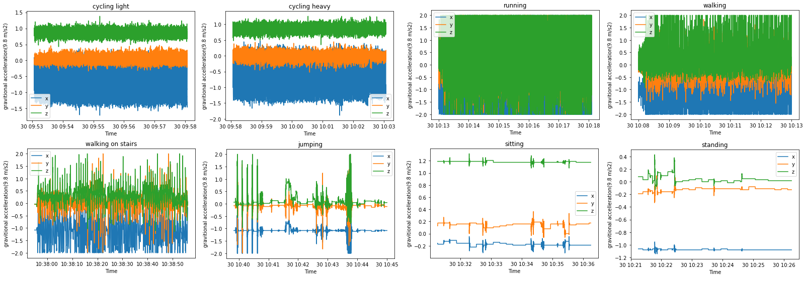

# portfolio
naam: Adnan Akbas
studentnummer: 17005116

## Project ActivPal

### Team members
- Ali
- Colin
- Mark
- Matthew

## Datacamp
  

 |Course|Statement of Accomplishment|
 |------|---------------------------|
 | Introduction to python |[proof](evidence/datacamp/introduction_to_python.pdf)|
 | Python Data Science Toolbox (Part 1) |[proof](evidence/datacamp/python_data_science_toolbox_part_1.pdf)|
 | Intermediate Python |[proof](evidence/datacamp/intermediate_python.pdf)|
 | Python Data Science Toolbox (Part 2) |[proof](evidence/datacamp/python_data_science_toolbox_part_2.pdf)|
 | Pandas Foundations |[proof](evidence/datacamp/pandas_foundations.pdf)|
 | Introduction to Data Visualization in Python |[proof](evidence/datacamp/introduction_to_data_visualization_in_python.pdf) |
 | Manipulating Dataframes with pandas |[proof](evidence/datacamp/manipulating_dataframes_with_pandas.pdf)|
 | Data Types for Data Science in Python |[proof](evidence/datacamp/data_types_for_data_science_in_python.pdf)|
 | Cleaning data in Python |[proof](evidence/datacamp/cleaning_data_in_python.pdf)|
 | Preprocessing for Machine Learning in Python |[proof](evidence/datacamp/preprocessing_for_machine_learning_in_python.pdf)|

### Research project

 
Task Definition

In the research plan I have written the second iteration of the problem domain/context while my teammates have worden on other parts. 
Where they have defined the research question among others. In the second iteration I have processed the feedback we got
from one of our teachers. 

``
Statistics Netherlands (CBS) has the wish to see if their respondents are moving for at least 150
minutes per week in moderately intense physical activity.
Currently, they are measuring by asking their respondent or health surveys. The issue with this is
that people are not very good at estimating the time they spent on moving and sport. This of course
causes that they don't have very reliable data to work with. Therefor CBS has been looking into
alternatives like the ActivPal accelerometer in combination with machine learning to give better and
more accurate results when measuring the intensity of certain activities.
Because of this the CBS started to collect lab tests and started to measure the movements of 41
correspondents in their regular workweek by using the Activepal Accelerator. It's our job to analyse,
structure and build machine learning algorithms based on the collected data to see if we can
determine if people adhere to (inter)national norm for physical activities and if we could measure
the intensity of movement (without the heart rate information).
``

src: [research_plan.pdf](evidence/documents/research_plan.pdf)

 
Evaluation

[More Examples](topics/research_project/evaluation.md)

 
Conclusions

[More Examples](topics/research_project/conclusions.md)

 
Planning

At the beginning of our project we have decided that we will use Jira as our scrum board and will implement Scrum in our way and won't follow it to the detail.
Our group was based on trust that's also the reason why we didn't setup nor sign a contract for teamwork. 

Our process looked as following. At the start of each sprint we decided what goal is for the sprint. With this goal in mind we created task which each team member could choose and take it on themself.
The task can be modified, removed or created while the sprint were going onbut that was always first discussed within the group before any modification.
Each morning at 9:30 our group was holding a stand-up. There we discussed what we did day earlier, going to do today and if we are stuck with something.
At the end of each sprint our group was holding retrospective where we discussed our progress and teamwork last sprint. The role of scrum master was taken on by Ali Safdari. 

## My role in scrum
I didn't have specific role in the scrum process other than developer but i did actively participate in each phase of 
the scrum process.At the sprint planning I have actively created task of course after discussing with the team. At the 
same time I would assign task to myself unless other team members would want them. In some cases we would assign 
multiple members to a task. Unfortunately Jira doesn't support that so we would write the names in description of the task.
Each morning I would join stand-up with my other team members and explain what i did yesterday, what i am gonna do today and if i need help.
Unfortnatly and reasonably we didn't take notes so I don't have evidence for this. At the end of each sprint I would 
join retrospective and give my input. I would say what we did well, what didn't go well and what i wish next sprint would get better.

[More information on our take](topics/research_project/planning.md)

### Domain knowledge

 
Introduction of the subject field

[More Examples](topics/domain_knowledge/introduction_of_the_subject_field.md)

 
literature Research

[More Examples](topics/research_project/literature_research.md)

 
Explanation of Terminology, jargon and definitions

[More Examples](topics/research_project/explanation_of_terminology_jargon_and_definitions.md)

### Data preprocessing

 
Data exploration

In the beginning of the project we did all kind of exploration of data.

[More Examples](topics/data_preprocessing/data_exploration.md)

 
Data cleaning

[More Examples](topics/data_preprocessing/data_cleaning.md)

 
Data preparation

[More Examples](topics/data_preprocessing/data_preparation.md)

 
Data visualization

To get an idea what kind of features we could use other than what the paper “” suggest I did some research into our data. 
I made a line plot for each activity for different respondents.  The image below shows clearly that each activity has 
a unique pattern. So with this information I concluded that we may not need peak-to-peak feature and just could use 
standard deviation and mean of each axis. The paper suggested different  features but at the end we only used  the 
suggested feature mean and standard deviation of the X-axis and dropped peak-to-peak feature. The scale of Y-axis at 
the time of decision didn’t really matter much because the pattern would still be the same. 
We did still descale it back gravitional acceleration at the end.  

[More Examples](topics/data_preprocessing/data_visualization.md)

### Predictive Analytics

 
selecting a model

[More Examples](topics/data_preprocessing/selecting_a_model.md)

 
training model

[More Examples](topics/data_preprocessing/training_model.md)

 
evaluating a model

[More Examples](topics/data_preprocessing/evaluating_a_model.md)

 
Visualizing the outcome of a model

[More Examples](topics/data_preprocessing/visualizing_the_outcome_of_a_model.md)

 
configuring a model

[More Examples](topics/data_preprocessing/configuring_a_model.md)

### communication

 
presentation

| Week | Contrubition | Link |
|------|--------------|------|
|1|No presentation||
|2|Contributed to the presentation by adding content to dia 5|[Week 2 presentation](evidence/presentations/week_2_internal.pdf)|
|3|Contributed to the presentation by adding content to dia 4 and I gave the presentation.|[Week 3 presentation](evidence/presentations/week_3_internal.pdf)|
|4|Contributed to the presentation by adding content to dia 2, 3, 12 and 13|[Week 4 presentation](evidence/presentations/week_4_external.pdf)|
|5|Contributed to the presentation by adding content to dia 3|[Week 5 presentation](evidence/presentations/week_5_internal.pdf)|
|6|Contributed to the presentation by adding content to dia 4, 5 and 6|[Week 6 presentation](evidence/presentations/week_6_internal.pdf)|
|7|Contributed to the presentation by adding content to dia 6 and I gave the presentation.|[Week 7 presentation](evidence/presentations/week_7_internal.pdf)|
|8|Contributed to the presentation by adding content to dia 8, 9, 10 and 11.|[Week 8 presentation](evidence/presentations/week_8_external.pdf)|
|9|Contributed to the presentation by adding content to dia 4.| [Week 9 presentation](evidence/presentations/week_9_internal.pdf)|
|10|Contributed to the presentation by adding content to dia 5 with Ali Safdari| [Week 10 presentation](evidence/presentations/week_10_internal.pdf)|
|11|Contributed to the presentation by adding content to dia 4.| [Week 11 presentation](evidence/presentations/week_11_internal.pdf)|
|12||
|13|Contributed to the presentation by adding content to dia 4.| [Week 13 presentation](evidence/presentations/week_13_external.pdf)|
|14|Contributed to the presentation by adding content to dia 4 and I gave the presentation| [Week 14 presentation](evidence/presentations/week_14_internal.pdf)|
|15|I didn't contribute anything | [Week 15 presentation](evidence/presentations/week_15_internal.pdf)|
|16| | [Week 16 presentation](evidence/presentations/week_16_external.pdf)|
|17|  | [Week 17 presentation](evidence/presentations/week_17_internal.pdf)|

 
writing paper

|Contribution|Iteration|Chapter|Link|
|------------|---------|-------|----|
|Wrote 1e iteration together with Ali Safdari. I tried to write it alone but I couldn't put the infromation about the method in the right way. Ali wrote the text while I told him what needs to be in the paper.|1| Subchapter activity recognition of chapter method|[1e iteration of subchapter acitivity recognition chapter method](evidence/paper_chapters/method_activity_recognition_version_1.pdf)|
|Processed feedback from my teammates |2| Subchapter activity recognition of chapter method|[2e iteration of subchapter acitivity recognition of chapter method](evidence/paper_chapters/method_activity_recognition_version_2.pdf)|
|Processed feedback from my teammates |3| Subchapter activity recognition of chapter method|[3e iteration of subchapter acitivity recognition of chapter method](evidence/paper_chapters/method_activity_recognition_version_3.pdf)|
|Wrote 1e iteration |1| Subchapter activity recognition of chapter result|[1e iteration of subchapter acitivity recognition of chapter result](evidence/paper_chapters/result_activity_recognition_version_1.pdf)|
|Processed feedback from my teammates|2| Subchapter activity recognition of chapter result|[2e iteration of subchapter acitivity recognition of chapter result](evidence/paper_chapters/result_activity_recognition_version_2.pdf)|
|Processed feedback from my teammates|3| Subchapter activity recognition of chapter result|[3e iteration of subchapter acitivity recognition of chapter result](evidence/paper_chapters/result_activity_recognition_version_3.pdf)|
|Wrote 1e iteration |1|subchapter study design of chapter data|[1e iteration of subchapter study design of chapter data](evidence/paper_chapters/data_study_design_version_1.pdf)|
|Wrote 1e iteration |1|subchapter subjects of chapter data|[subchapter subjects of chapter data](evidence/paper_chapters/data_subjects_version_1.pdf)|

