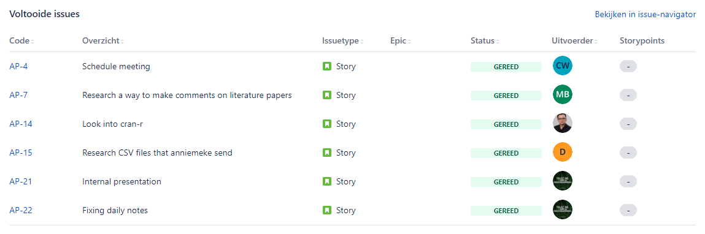
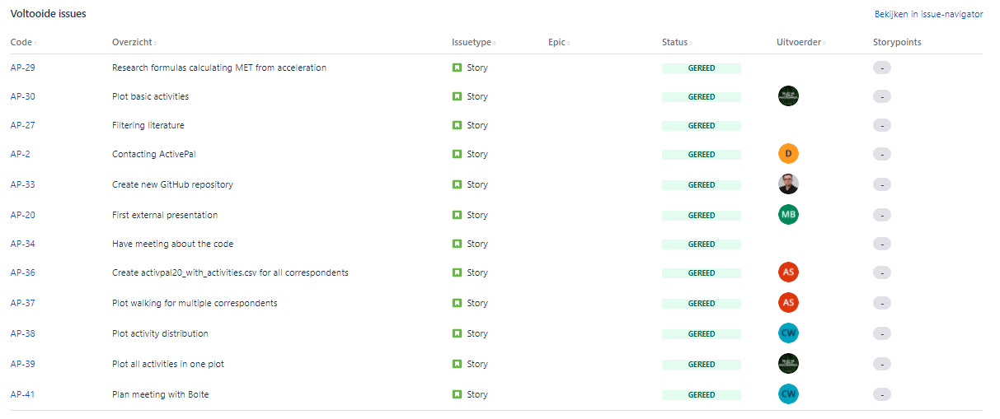
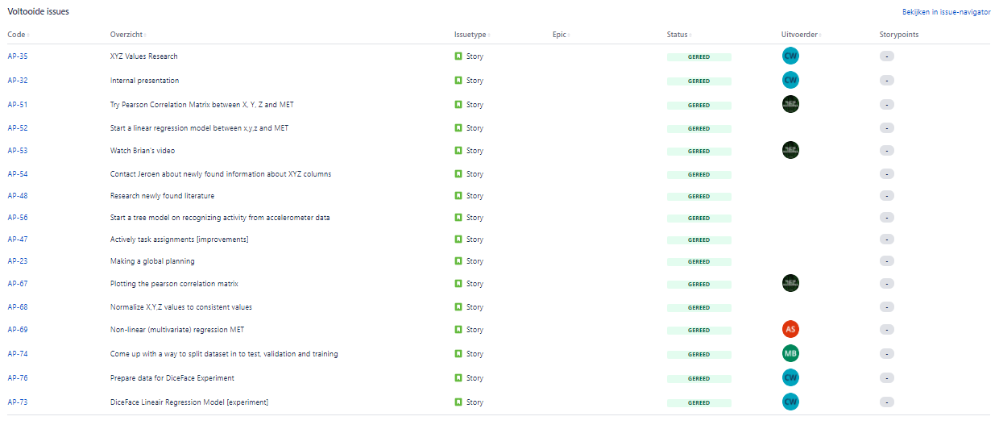
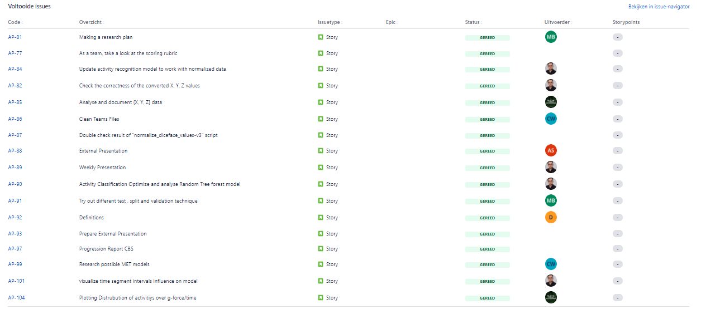
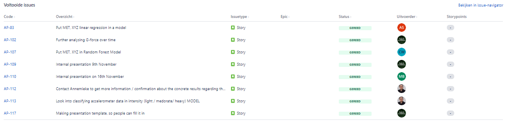
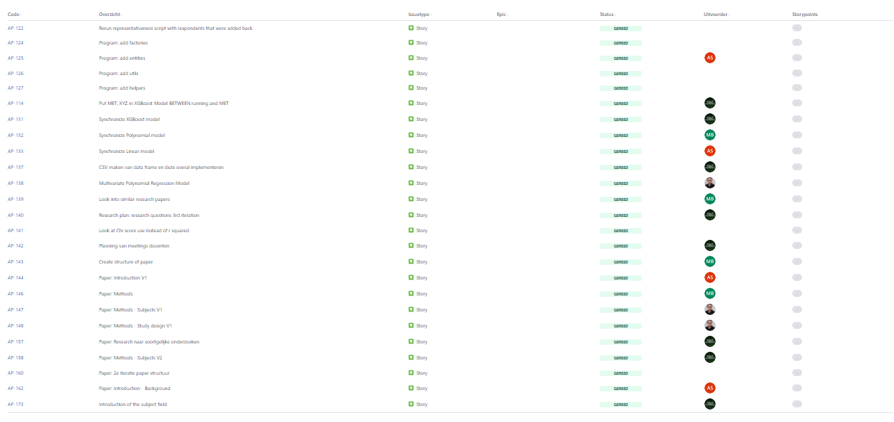

# Planning
## Scrum implementation
At the beginning of our project we have decided that we will use Jira as our scrum board and will implement Scrum in our way and won't follow it to the detail.
Our group was based on trust that's also the reason why we didn't setup nor sign a contract for teamwork. 

Our process looked as following. At the start of each sprint we decided what goal is for the sprint. With this goal in mind we created task which each team member could choose and take it on themself.
The task can be modified, removed or created while the sprint were going onbut that was always first discussed within the group before any modification.
Each morning at 9:30 our group was holding a stand-up. There we discussed what we did day earlier, going to do today and if we are stuck with something.
At the end of each sprint our group was holding retrospective where we discussed our progress and teamwork last sprint. The role of scrum master was taken on by Ali Safdari. 

## My role in scrum
I didn't have specific role in the scrum process other than developer but i did actively participate in each phase of 
the scrum process.At the sprint planning I have actively created task of course after discussing with the team. At the 
same time I would assign task to myself unless other team members would want them. In some cases we would assign 
multiple members to a task. Unfortunately Jira doesn't support that so we would write the names in description of the task.
Each morning I would join stand-up with my other team members and explain what i did yesterday, what i am gonna do today and if i need help.
Unfortunately and reasonably we didn't take notes so I don't have evidence for this. At the end of each sprint I would 
join retrospective and give my input. I would say what we did well, what didn't go well and what i wish next sprint would get better.

## Sprints with retrospective 

The images below doesn't represent how much i contributed to project really well. The reason for this while we did our 
best to keep scrumboard up-to-date without activities but we definitly forgot to create al lot of tasks on jira. 

### sprint 1

[retrospective notes](../../evidence/scrum_documents/retrospective_notes/retrospective_sprint_1.pdf)
### sprint 2

[retrospective notes](../../evidence/scrum_documents/retrospective_notes/retrospective_sprint_2.pdf)
### sprint 3

Unfortunately i couldn't find the notes from retrospective of week 3.
### sprint 4

[retrospective notes](../../evidence/scrum_documents/retrospective_notes/retrospective_sprint_4.pdf)
### sprint 5

[retrospective notes](../../evidence/scrum_documents/retrospective_notes/retrospective_sprint_5.pdf)
### sprint 6

[retrospective notes](../../evidence/scrum_documents/retrospective_notes/retrospective_sprint_6.pdf)

### sprint 7

[retrospective notes](../../evidence/scrum_documents/retrospective_notes/retrospective_sprint_7.pdf)

